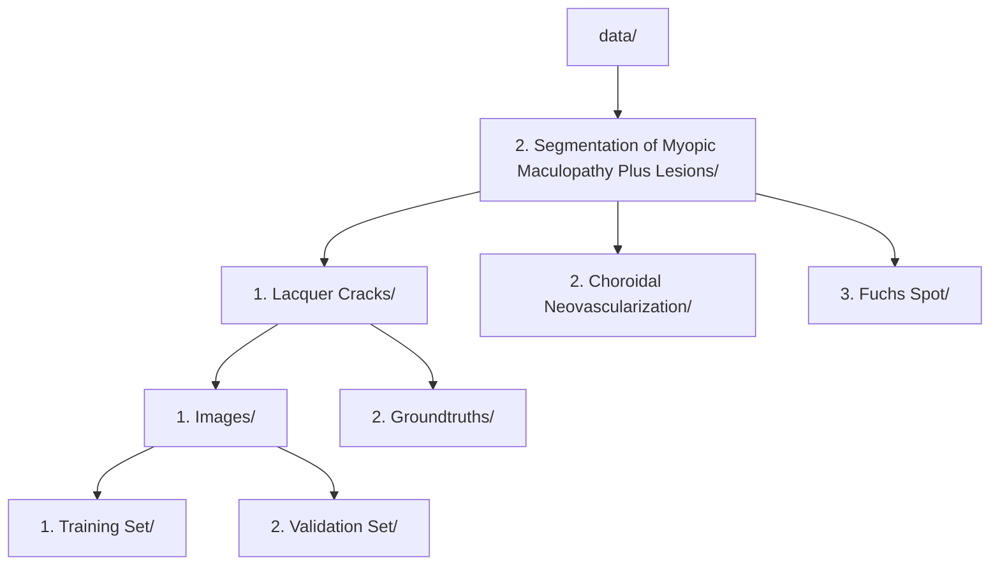

# MMAC LaTIM Solution

This repository contains code and resources for the MICCAI MMAC 2023 - Myopic Maculopathy Analysis Challenge (Task 2).

## Project Structure
- `data/` - Data directory (not included, see instructions below)
- `Inference/` - Inference scripts and models
- `Training/` - Training scripts and model definitions
- `json_to_png.py` - Utility script

## Data
The data required for this project is not included in the repository due to size and licensing restrictions.

To obtain the data, please visit the official competition page: [MICCAI MMAC 2023 - Myopic Maculopathy Analysis Challenge - Task 2](https://codalab.lisn.upsaclay.fr/competitions/12476)

After downloading, place the data in this `data/` directory, preserving the folder structure as described in the competition documentation.

### Data Directory Structure

## Getting Started
1. Clone this repository.
2. Download the data as described above.
3. Set up your Python environment and install dependencies (see below).

## License
See `LICENSE` for details.

# MMAC_LaTIM_Solution

Here's the [LaTIM](https://latim.univ-brest.fr/) team's solution in the [MICCAI MMAC 2023 Challenge](https://codalab.lisn.upsaclay.fr/competitions/12477#learn_the_details-overview).

We are the **TOP 8** of the Task 1-Classification of myopic maculopathy, the **TOP 2** of the Task 2-Segmentation of myopic maculopathy plus lesions, and the **TOP 1** of the Task 3-Prediction of spherical equivalent. 

If you use our code, please cite: [Automated Detection of Myopic Maculopathy in MMAC 2023: Achievements in Classification, Segmentation, and Spherical Equivalent Prediction]().

--- 

## Training

This table provides a brief description of our operators and detailed parameters for training. Unless otherwise specified, all experiments are conducted using reported configurations and parameters.

## Inference

Submissions and weights for the validation and testing phases (four versions per task): [Submissions_MMAC_LaTIM](https://drive.google.com/drive/folders/1NuIb90U53INq_BZUO9zdG2gpz_wvs9pm?usp=sharing)

### Task 1 - Classification of myopic maculopathy

### Task 2 - Segmentation of myopic maculopathy plus lesions

### Task 3 - Prediction of spherical equivalent

